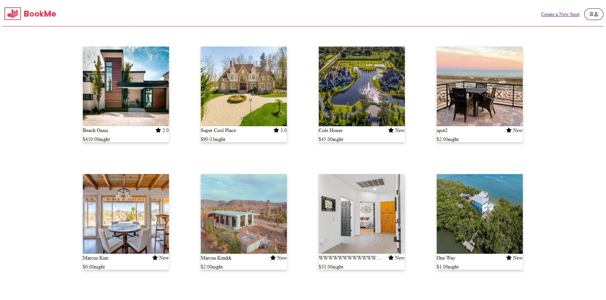
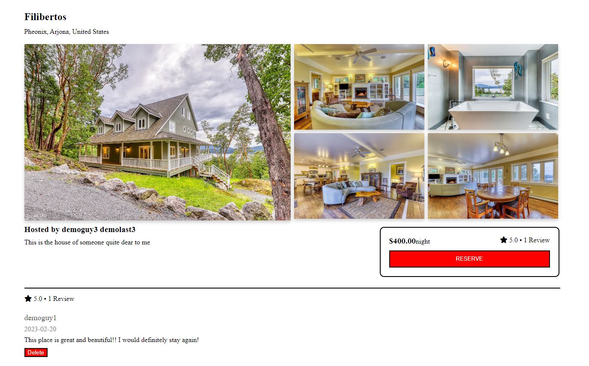
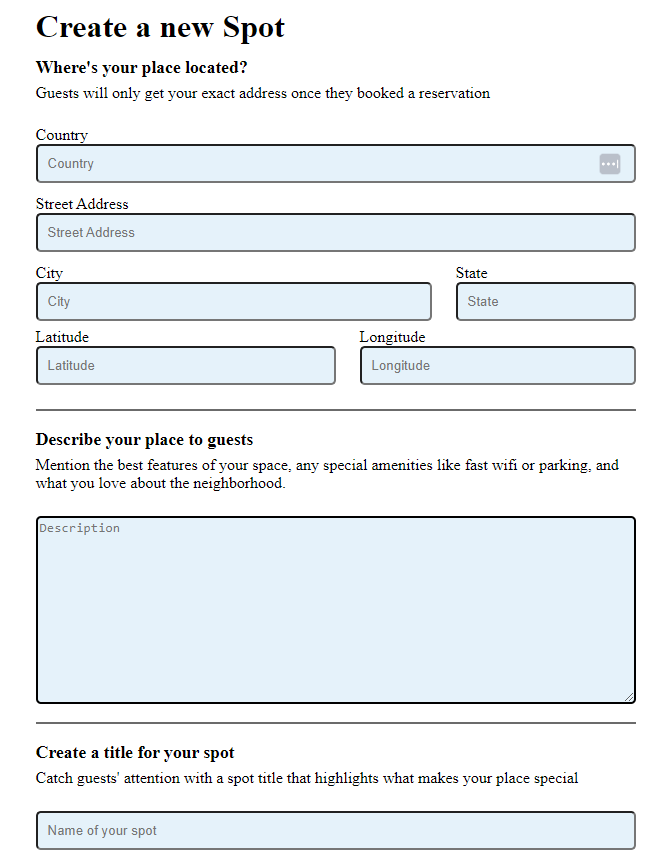
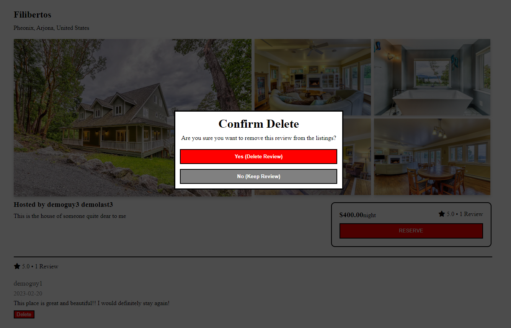
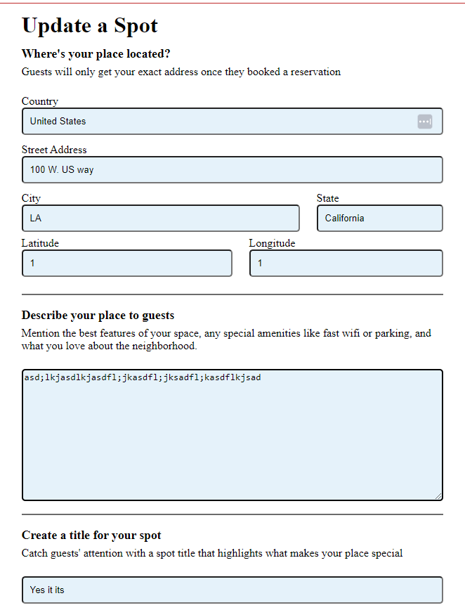
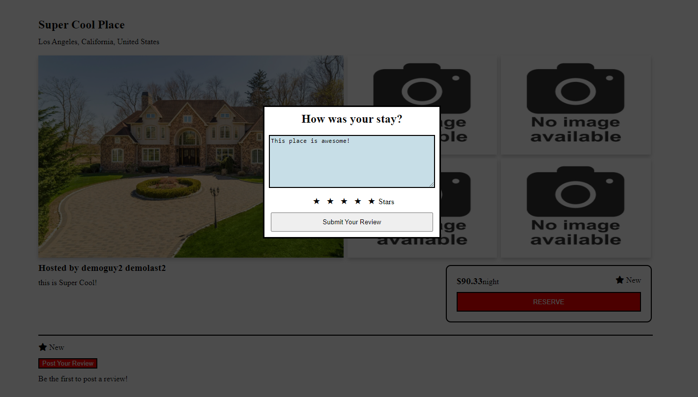

# About BookMe
---
BookMe is a full-stack web application that is designed to help users find a place to stay; whether it be for vacation, work, or any type of travel! This is my first full-stack project which showcases all of the programming skills I've developed so far.

## Technologies Used:

- React
- Redux
- JavaScript
- Express
- Sequelize
- PostgreSQL

## Launching Locally:
1. Clone the starter code down to your machine
2. In the backend folder, run `npm dotenv sequelize db:migrate && npm dotenv sequelize db:seed:all && npm start`
3. Run `npm start` in the front end folder

## Feature Overview

Here are some of the features I've implemented

**Landing Page**

**Details Page**

**Creating a Spot**

**Deleting a Spot**

**Updating a Spot**

**Posting a Review**

